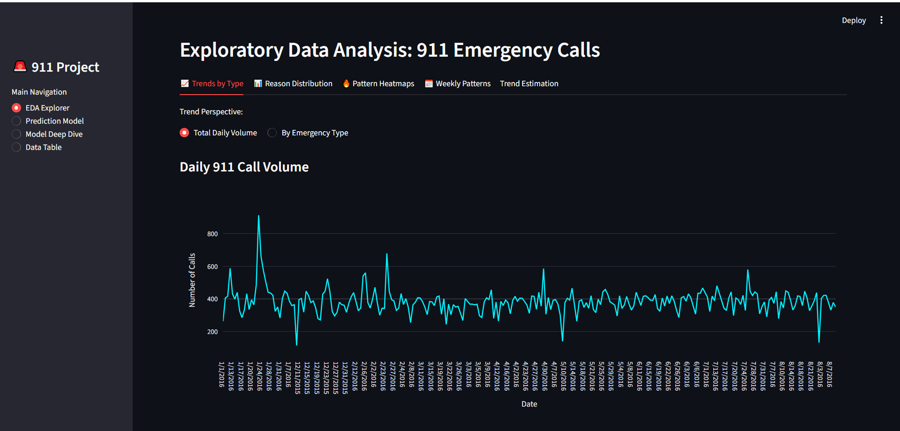
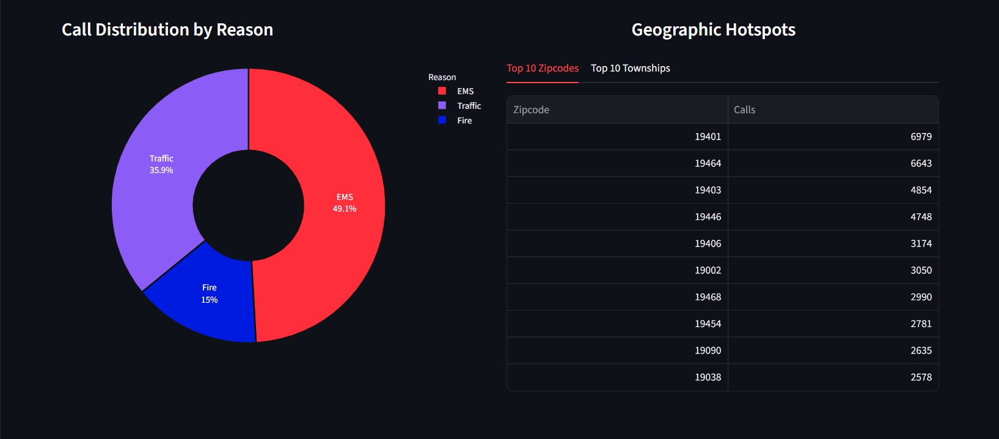
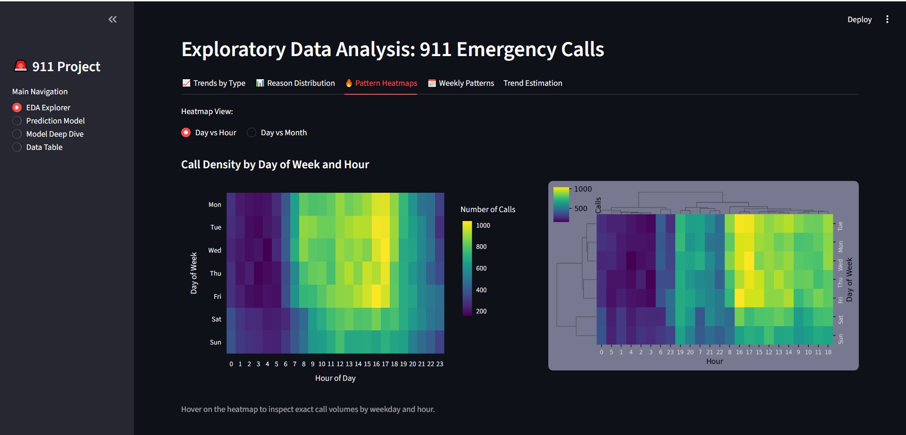
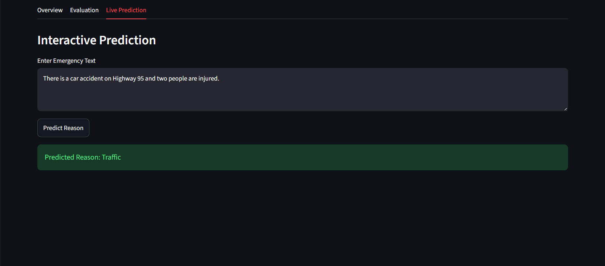
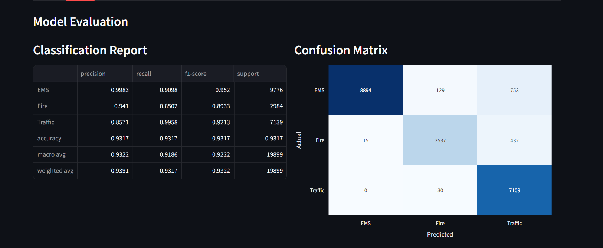

# 🚨 Emergency Call Analytics Dashboard with NLP

An interactive **Streamlit dashboard** for analyzing 911 emergency calls and predicting emergency categories using **Natural Language Processing**.

🔗 **Live Demo:**  
[911 Calls Analytics & Prediction App](https://emergency-call-analytics-dashboard-with-nlp-o7c7sfhuxq7khf7e3j.streamlit.app/)


## 📌 Features

-  Emergency call EDA and visualization
-  Geographic hotspot analysis
-  Time-based pattern analysis
-  NLP text classification model
-  Live emergency reason prediction

---

## 📸 Dashboard Preview

### 📊 Exploratory Data Analysis
Interactive analysis of emergency call trends, distributions, geographic hotspots, and time-based patterns.




### 📊 Emergency Reason Distribution
Analysis of emergency categories and their distribution across the dataset.




### 🔥 Temporal Pattern Heatmap
Heatmap visualization showing emergency call patterns across different time periods.




### 🤖 NLP Prediction Model
Real-time prediction system that classifies emergency calls into EMS, Fire, and Traffic categories.




### 📈 Model Evaluation
Performance analysis using classification report and confusion matrix.



---

## 🤖 Machine Learning

**Model:** Multinomial Naive Bayes

**Pipeline:**

- Text Cleaning
- Stopword Removal
- Stemming
- CountVectorizer Feature Extraction
- Multinomial Naive Bayes Classification


### Classes

- 🚑 EMS
- 🔥 Fire
- 🚗 Traffic


### Performance

- Accuracy: **93.10%**
- Weighted F1-score: **93%**

---

## 🛠 Tech Stack

Python • Streamlit • Pandas • Plotly • Scikit-learn • NLTK


---

## ▶️ Run Locally

```bash
pip install -r requirements.txt
streamlit run app.py

